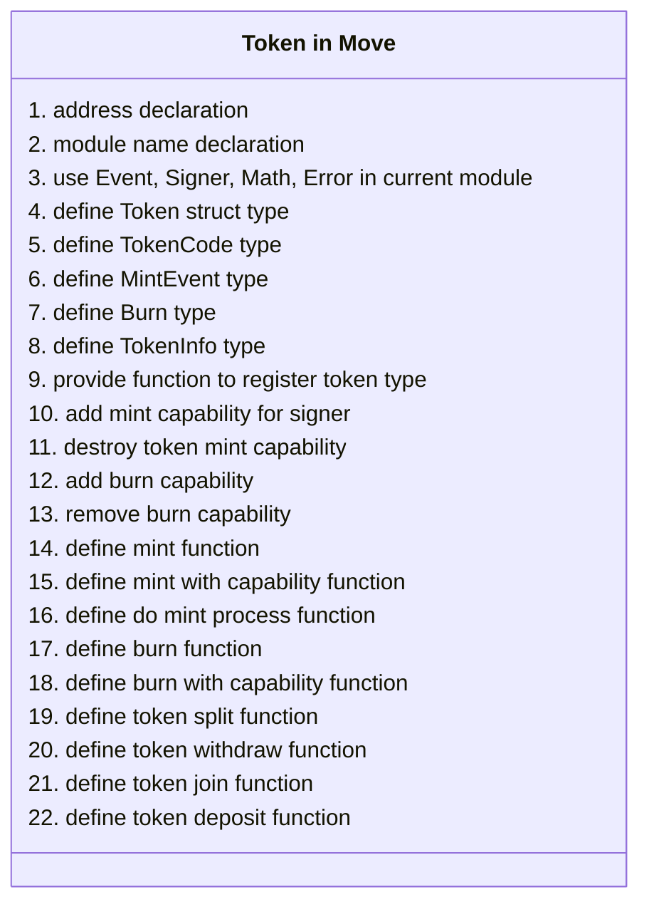

# Blockchain Overview

## Move Token Contract

```mermaid
classDiagram
    class `Token in Move` {
        1. address declaration
        2. module name declaration
        3. use Event, Signer, Math, Error in current module
        4. define Token struct type
        5. define TokenCode type
        6. define MintEvent type
        7. define Burn type
        8. define TokenInfo type
        9. provide function to register token type
        10. add mint capability for signer
        11. destroy token mint capability
        12. add burn capability
        13. remove burn capability
        14. define mint function
        15. define mint with capability function
        16. define do mint process function
        17. define burn function
        18. define burn with capability function
        19. define token split function
        20. define token withdraw function
        21. define token join function
        22. define token deposit function
    }
```    
