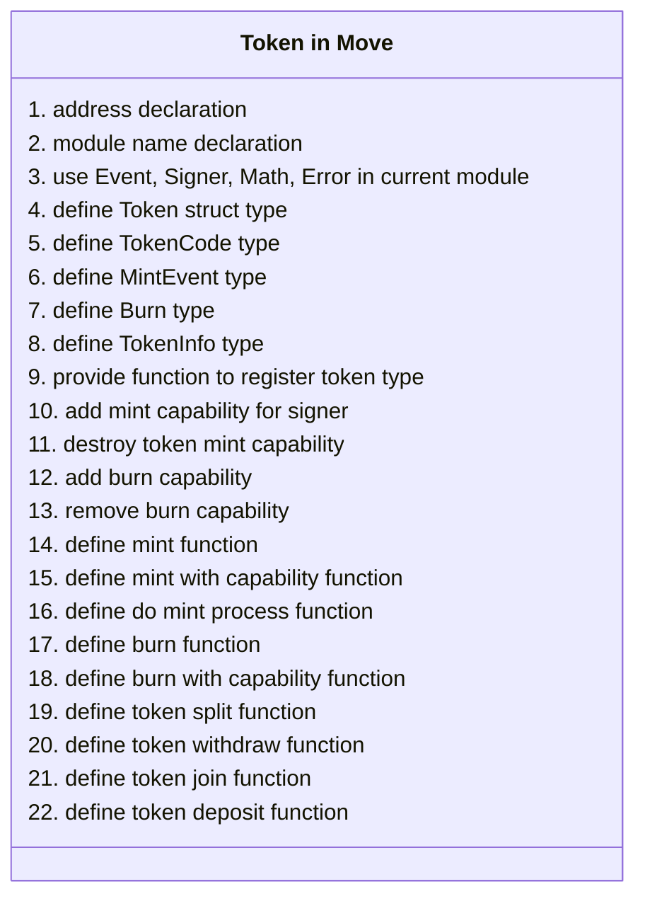
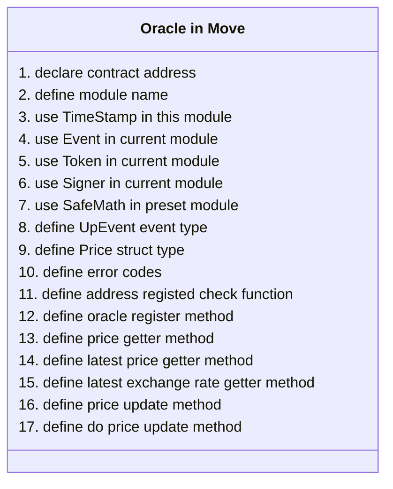
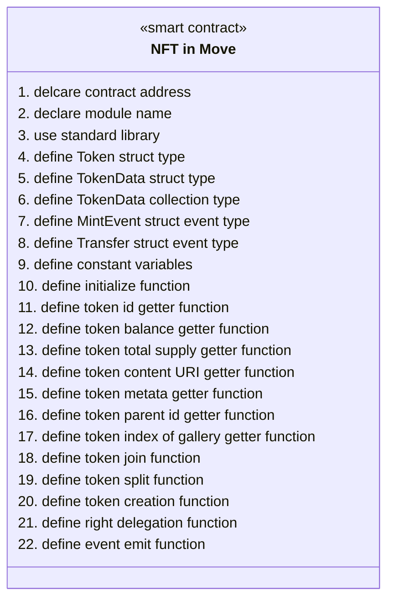
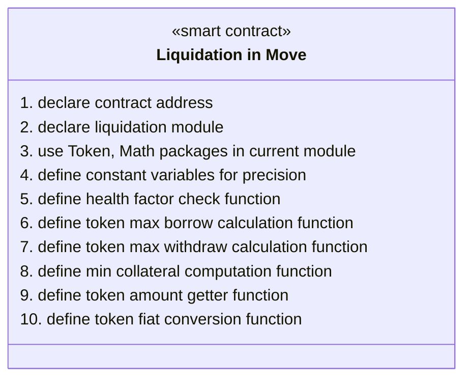

# Blockchain Overview

## Move Token Contract

```mermaid
classDiagram
    class `Token in Move` {
        1. address declaration
        2. module name declaration
        3. use Event, Signer, Math, Error in current module
        4. define Token struct type
        5. define TokenCode type
        6. define MintEvent type
        7. define Burn type
        8. define TokenInfo type
        9. provide function to register token type
        10. add mint capability for signer
        11. destroy token mint capability
        12. add burn capability
        13. remove burn capability
        14. define mint function
        15. define mint with capability function
        16. define do mint process function
        17. define burn function
        18. define burn with capability function
        19. define token split function
        20. define token withdraw function
        21. define token join function
        22. define token deposit function
    }
```    

## Move Oracle

```mermaid
classDiagram
    class `Oracle in Move` {
        1. declare contract address
        2. define module name
        3. use TimeStamp in this module
        4. use Event in current module
        5. use Token in current module
        6. use Signer in current module
        7. use SafeMath in preset module
        8. define UpEvent event type
        9. define Price struct type
        10. define error codes
        11. define address registed check function
        12. define oracle register method
        13. define price getter method
        14. define latest price getter method
        15. define latest exchange rate getter method
        16. define price update method
        17. define do price update method
    }
```

## Move NFT

```mermaid
classDiagram
    class `NFT in Move` {
        <<smart contract>>
        1. delcare contract address
        2. declare module name
        3. use standard library
        4. define Token struct type
        5. define TokenData struct type
        6. define TokenData collection type
        7. define MintEvent struct event type
        8. define Transfer struct event type
        9. define constant variables
        10. define initialize function
        11. define token id getter function 
        12. define token balance getter function
        13. define token total supply getter function
        14. define token content URI getter function
        15. define token metata getter function
        16. define token parent id getter function
        17. define token index of gallery getter function
        18. define token join function
        19. define token split function
        20. define token creation function
        21. define right delegation function
        22. define event emit function
    }
```

## Move Liquidation

```mermaid
classDiagram
    class `Liquidation in Move` {
        <<smart contract>>
        1. declare contract address
        2. declare liquidation module
        3. use Token, Math packages in current module
        4. define constant variables for precision
        5. define health factor check function
        6. define token max borrow calculation function 
        7. define token max withdraw calculation function
        8. define min collateral computation function
        9. define token amount getter function
        10. define token fiat conversion function
    }
```

