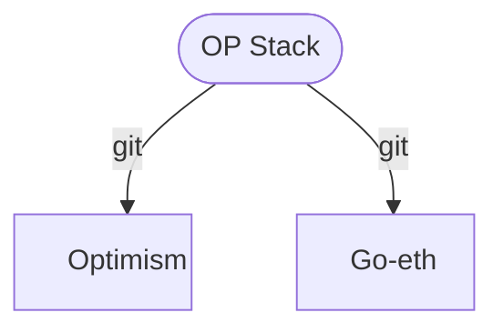
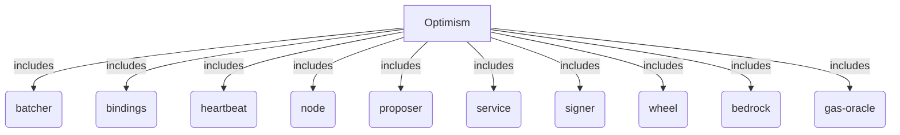

# OP Stack

## Git Repository

```mermaid
flowchart
    a -- git --> b & c
    a([OP Stack])
    b[Optimism]
    c[Go-eth]
    classDef git width: 100px, text-align: center
    class b,c git
```

```mermaid
flowchart 
    a -->|includes| b & c & d & e & f & g & h & i & j & k
    a[Optimism]
    b(batcher)
    c(bindings)
    e(export)
    d(heartbeat)
    e(node)
    f(proposer)
    g(service)
    h(signer)
    i(wheel)
    j(bedrock)
    k(gas-oracle)
```    
