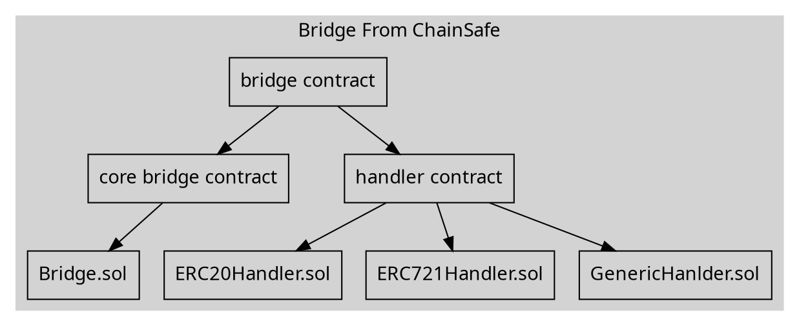

# Bridge

```dot
digraph {
    graph [fontname="Handlee"];
    node [fontname="Handlee"];
    edge [fontname="Handlee"];
    subgraph cluster {
        style=filled;
        color=lightgrey;
        label="Bridge From ChainSafe";
        node [shape="box"];
        a [label="bridge contract"];
        b [label="core bridge contract"];
        c [label="handler contract"];
        d [label="Bridge.sol"];
        e [label="ERC20Handler.sol"]
        f [label="ERC721Handler.sol"]
        g [label="GenericHanlder.sol"]
        a -> {b c}
        b -> d
        c -> {e f g}
    }
}
```
