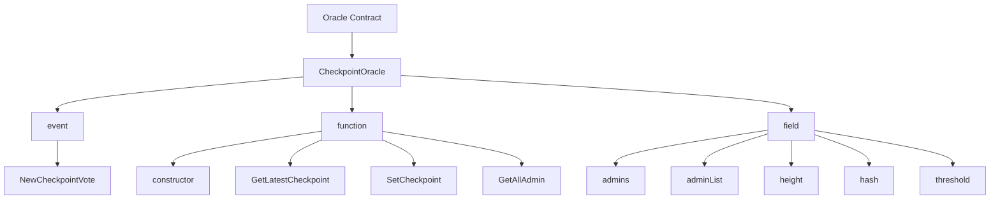

# Ethereum Network

## Code Review

```mermaid
graph
    a[Oracle Contract]
    b[CheckpointOracle]
    c[event]
    ca[NewCheckpointVote]
    d[function]
    da[constructor]
    db[GetLatestCheckpoint]
    dc[SetCheckpoint]
    dd[GetAllAdmin]
    e[field]
    ea[admins]
    eb[adminList]
    ec[height]
    ed[hash]
    ee[threshold]
    a --> b 
    b --> c & d & e
    c --> ca
    d --> da & db & dc & dd
    e --> ea & eb & ec & ed & ee 
```
