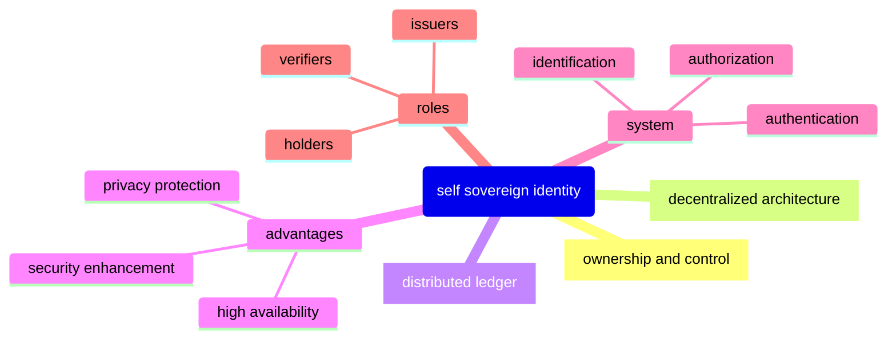

# Build Web3

## Identity Service

```mermaid
mindmap
    ssi(self sovereign identity)
        feature[ownership and control]
        technology[decentralized architecture]
        storage[distributed ledger]
        advantages
            privacy protection
            security enhancement
            high availability
        system
            identification
            authentication
            authorization
        roles
            holders
            issuers
            verifiers
        
```
