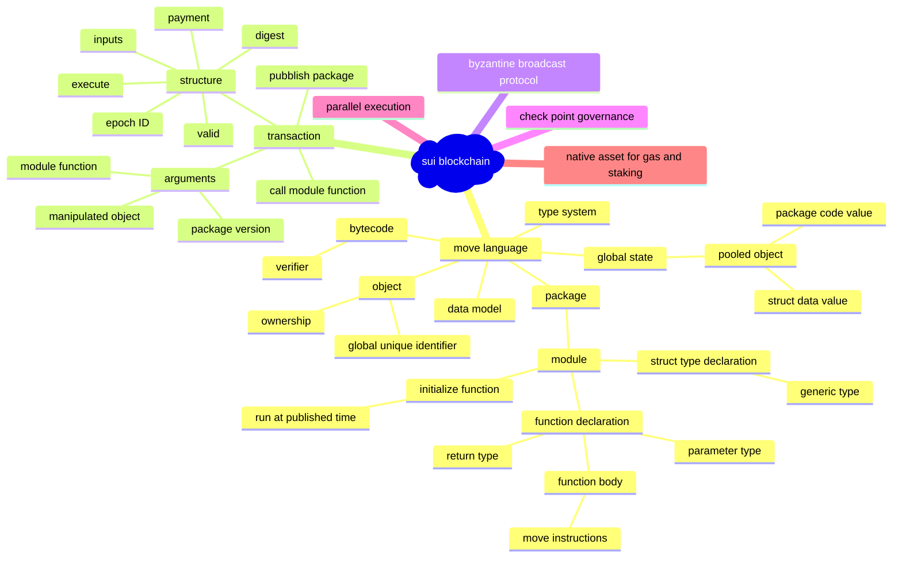
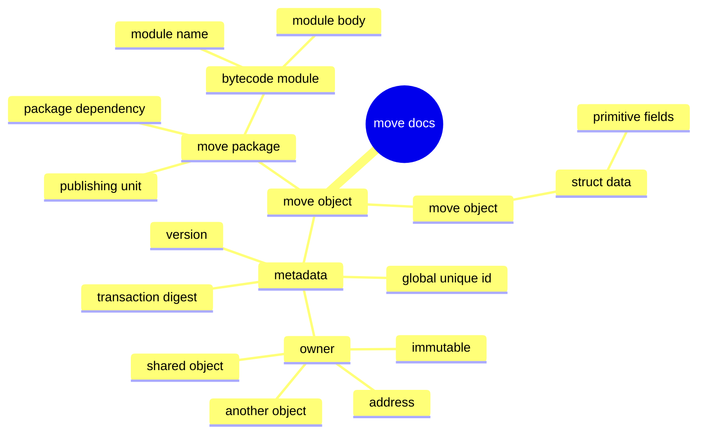

# Sui

## White Paper

```mermaid
mindmap
    root)sui blockchain(
        move language
            type system
            data model
            global state
                pooled object
                    struct data value
                    package code value
            package
                module
                    struct type declaration
                        generic type
                    function declaration
                        parameter type
                        return type
                        function body
                            move instructions
                    initialize function
                        run at published time
            bytecode
                verifier
            object
                global unique identifier
                ownership
        transaction
            pubblish package
            call module function
            arguments
                manipulated object
                package version
                module function
            structure
                digest
                epoch ID
                inputs
                payment
                valid
                execute
        byzantine broadcast protocol
        check point governance
        parallel execution
        native asset for gas and staking
```

## Move Object

```mermaid
mindmap
    root((move docs))
        move object
            move package
                bytecode module
                    module name
                    module body
                publishing unit
                package dependency                
            move object
                struct data
                    primitive fields
            metadata
                global unique id
                version
                transaction digest
                owner
                    address
                    another object
                    immutable
                    shared object
```
