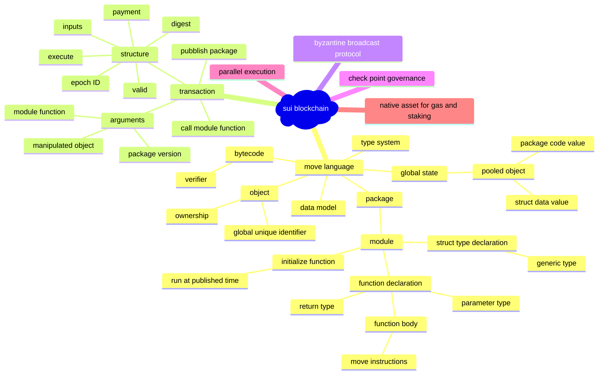
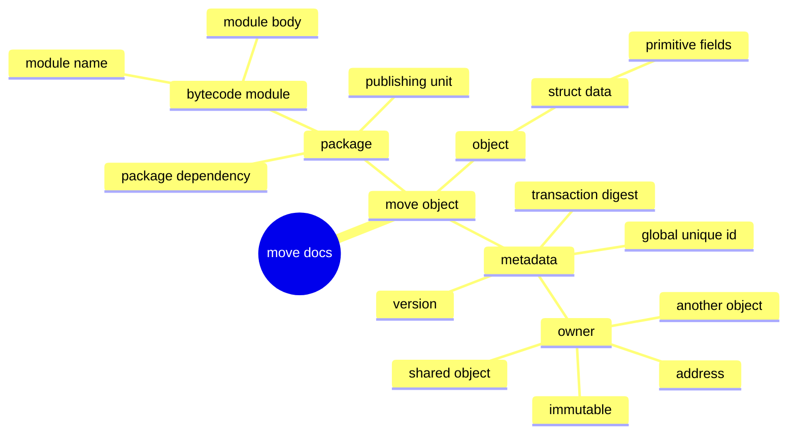

# Sui

## White Paper



## Move Object



## Source Code

```mermaid
classDiagram
    class `Struct Type in Move ` {
        This explains how move struct are expressed in Rust language
        (1): The struct type has several fields and it is vector type.
        (2): The struct type has its ability set.
        (3): If it is generic type, it has parameter types.
        (4): Its name acts as its identifier.
        (5): The struct type belongs to one module and has module identifier to reflect the relationship.
        (6): The index is used to decribe its location in the module.
    }
    
    class `The primitive types in Move` {
        The collection of primitive types
        (1): bool type
        (2): unsigned 8 bits number
        (3): unsiged 64 bits number
        (4): unsigned 128 bits number
        (5): address type
        (6): signer type
        (7): struct type
        (8): reference type
        (9): mutable reference type
    }
```

```mermaid
classDiagram
    class `Runtime of Move virtual machine` {
        Explain how the bytecode is loaded, parsed and executed in the virtual machine.
        (1): If the data does not exist in the local cache, it will be loaded from remote store.
        (2): The debug capability is provided for the virtual machine.
        (3): The value is inserted into vector and the index and key are stored into map container.
        (4): A Loader is responsible to load scripts and modules.
        (5): Scripts are verified and dependencies are loaded.
        (6): All native functions must be known to the loader.
        (7): The loader can load script, module and types.
        (8): A Resolver is a simple and small structure allocated on the stack and used by the interpreter.
        (9): A Script is very similar to a `CompiledScript` but data is "transformed" to a representation more appropriate to execution.
        (10): A Module is very similar to a binary Module but data is "transformed" to a representation more appropriate to execution.
        (11): The MoveVM struct has one field named runtime and its type is VMRuntime.
        (12): The VMRuntime struct has one field named loader and its type is Loader.
        (13): Interpreter instances can execute Move functions.
        (14): An Interpreter instance is a stand alone execution context for a function with an call stack and an operand stack.
        (15): A Frame is the execution context for a function.        
    }
```
