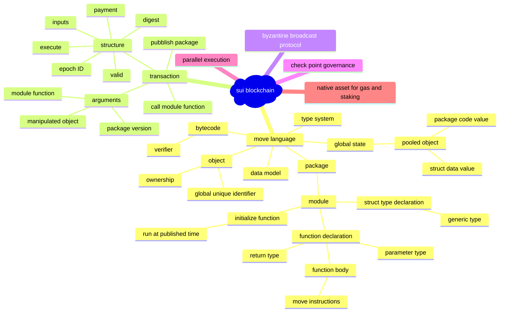
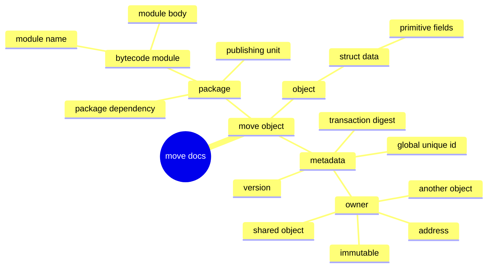

# Sui

## White Paper



## Move Object



## Source Codes

```mermaid
classDiagram
    class `Struct Type in Move ` {
        This explains how move struct are expressed in Rust language
        (1): The struct type has several fields and it is vector type.
        (2): The struct type has its ability set.
        (3): If it is generic type, it has parameter types.
        (4): Its name acts as its identifier.
        (5): The struct type belongs to one module and has module identifier to reflect the relationship.
        (6): The index is used to decribe its location in the module.
    }
    
    class `The primitive types in Move` {
        The collection of primitive types
        (1): bool type
        (2): unsigned 8 bits number
        (3): unsiged 64 bits number
        (4): unsigned 128 bits number
        (5): address type
        (6): signer type
        (7): struct type
        (8): reference type
        (9): mutable reference type
    }
```
