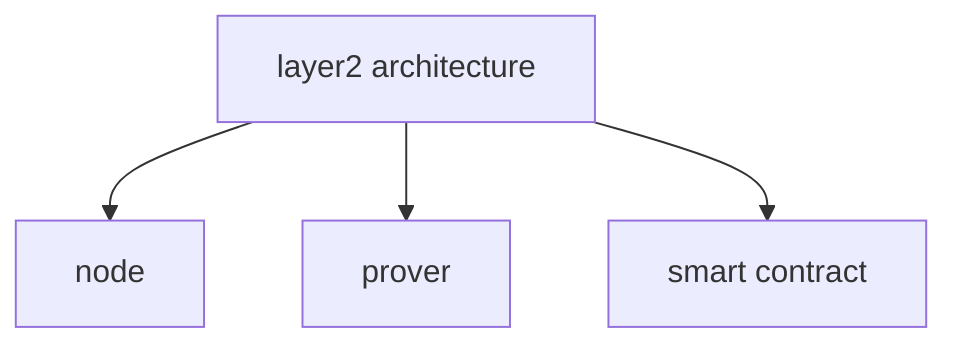
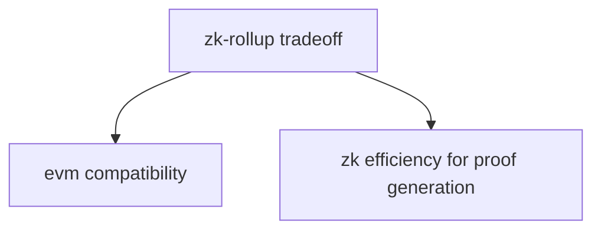

# Taiko 

- [white paper](https://taikoxyz.github.io/taiko-mono/taiko-whitepaper.pdf)
- [github](https://github.com/taikoxyz)

## Visualization

```mermaid
classDiagram
    class RollUP {
        <<solution>>
        It is scaling solution
        (1): optimistic rollup
        (2): zk rollup
        (3): validium rollup
        (4): volition rollup
    }
```





```mermaid
classDiagram
    class `block submission process` {
        <<process>>
        block life cycle
        (1): block proposal
        (2): block verification
    }
```

