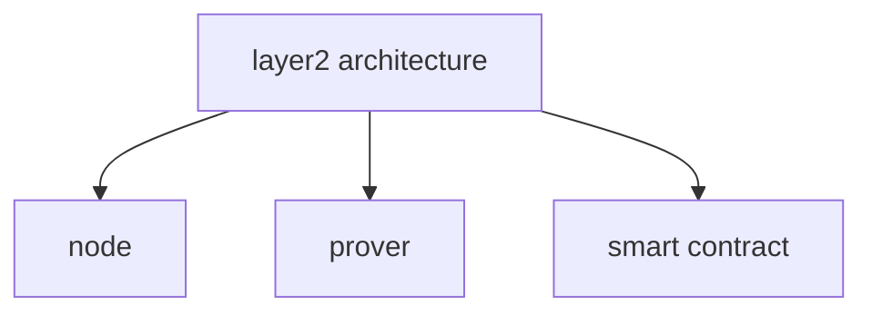
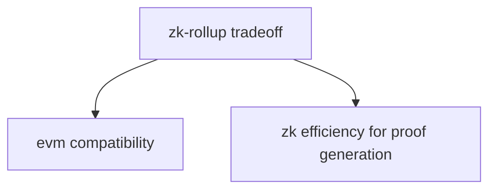

# Taiko 

## Visualization

```mermaid
graph
    a[layer2 architecture]
    b[node]
    c[prover]
    d[smart contract]
    a --> b & c & d
```

```mermaid
graph
    a[zk-rollup tradeoff]
    b[evm compatibility]
    c[zk efficiency for proof generation]
    a --> b & c
```    
