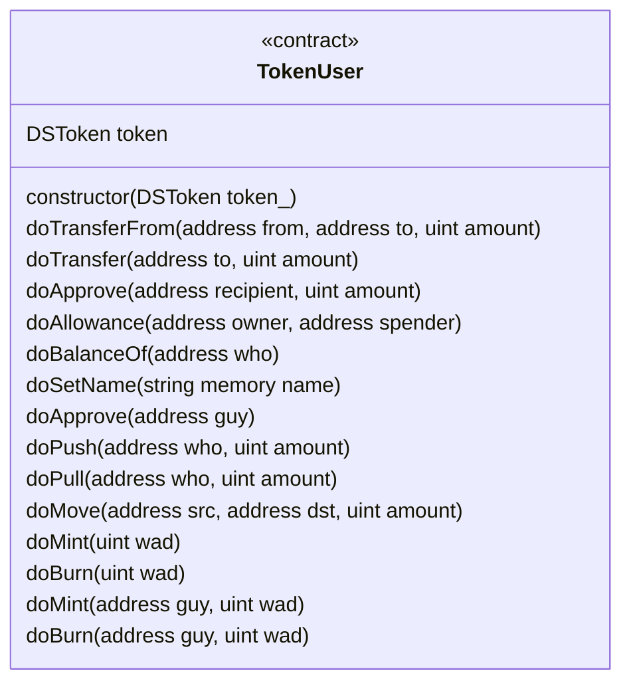

# Marker DAO

## Stable Coin

```mermaid
classDiagram
    class TokenUser {
        <<contract>>
        DSToken  token
        constructor(DSToken token_)
        doTransferFrom(address from, address to, uint amount)
        doTransfer(address to, uint amount)
        doApprove(address recipient, uint amount)
        doAllowance(address owner, address spender)
        doBalanceOf(address who)
        doSetName(string memory name)
        doApprove(address guy)
        doPush(address who, uint amount)
        doPull(address who, uint amount)
        doMove(address src, address dst, uint amount)
        doMint(uint wad)
        doBurn(uint wad)
        doMint(address guy, uint wad)
        doBurn(address guy, uint wad)
    }
```
