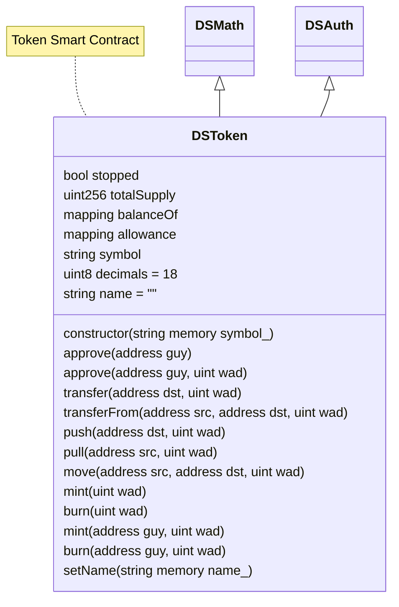
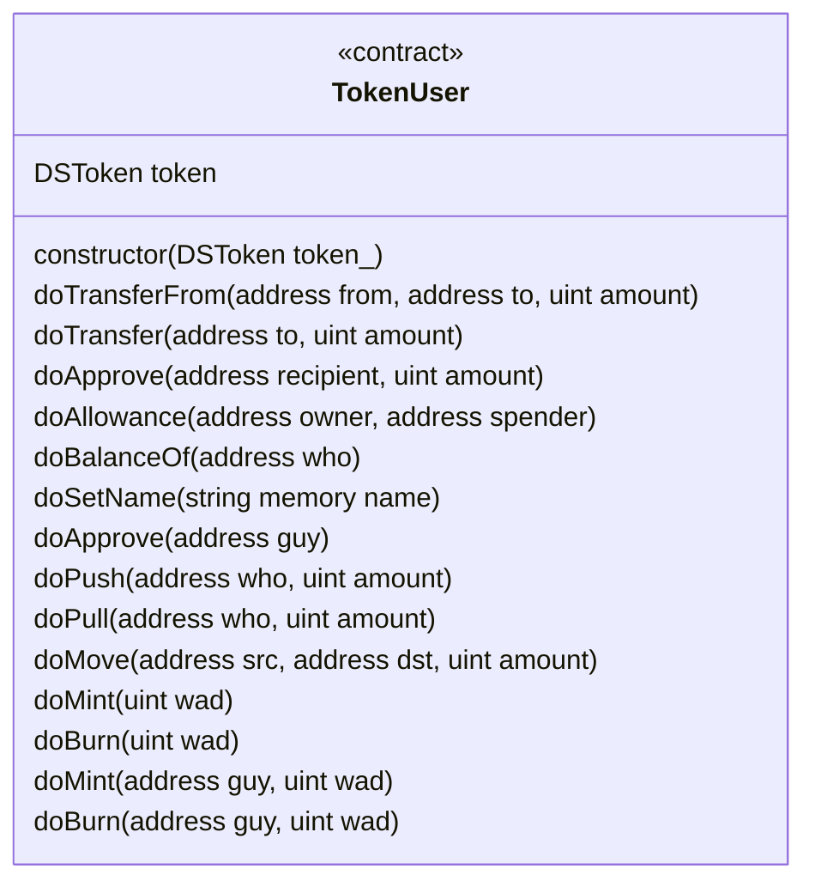

# Marker DAO

## Stable Coin

```mermaid
classDiagram
    note for DSToken "Token Smart Contract" 
    DSMath <|-- DSToken
    DSAuth <|-- DSToken

    class DSToken {
        bool stopped
        uint256 totalSupply
        mapping balanceOf
        mapping allowance
        string symbol
        uint8 decimals = 18
        string name = ""
        constructor(string memory symbol_)
        approve(address guy)
        approve(address guy, uint wad)
        transfer(address dst, uint wad)
        transferFrom(address src, address dst, uint wad)
        push(address dst, uint wad)
        pull(address src, uint wad)
        move(address src, address dst, uint wad)
        mint(uint wad)
        burn(uint wad)
        mint(address guy, uint wad)
        burn(address guy, uint wad)
        setName(string memory name_)
    }
```

```mermaid
classDiagram
    class TokenUser {
        <<contract>>
        DSToken  token
        constructor(DSToken token_)
        doTransferFrom(address from, address to, uint amount)
        doTransfer(address to, uint amount)
        doApprove(address recipient, uint amount)
        doAllowance(address owner, address spender)
        doBalanceOf(address who)
        doSetName(string memory name)
        doApprove(address guy)
        doPush(address who, uint amount)
        doPull(address who, uint amount)
        doMove(address src, address dst, uint amount)
        doMint(uint wad)
        doBurn(uint wad)
        doMint(address guy, uint wad)
        doBurn(address guy, uint wad)
    }
```
